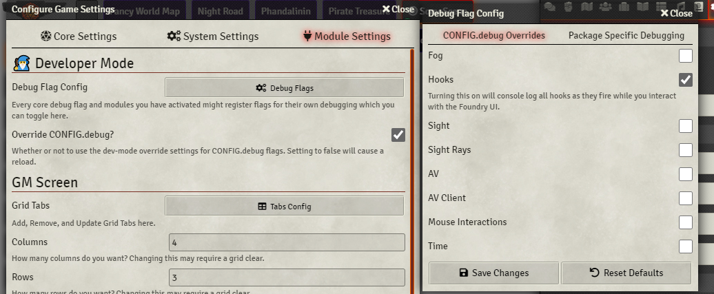

# 🧙 Developer Mode


[](https://forge-vtt.com/bazaar#package=_dev-mode)
[](https://www.foundryvtt-hub.com/package/_dev-mode/)
[](https://www.foundryvtt-hub.com/package/_dev-mode/)


A swiss army knife for development tooling in Foundry VTT.

## Features

- Provides a UI to toggle any Foundry Core CONFIG.debug flags, persisting the selection in the user's client settings.
- Provides an API to register and read a "debug mode flag" which is either a boolean or a number from 0 to 5 (log level).
- Provides a UI to toggle these flags on and off, preserving this selection in the user's client settings.



### Goal
Enable developers to stop putting debug code in their module code which accidentally gets shipped.

## TODO

1. Leverage the potential future `CONFIG.debug.moduleDebug` flag.
1. Implement other developer tooling. Have an idea? [Leave a suggestion!](https://github.com/League-of-Foundry-Developers/foundryvtt-devMode/issues/new?assignees=&labels=enhancement%2C+suggestion&template=feature_request.md&title=)

## Installation

Module JSON:

```
https://github.com/League-of-Foundry-Developers/foundryvtt-devMode/releases/latest/download/module.json
```

## Configuration

| **Name**                     | Description                                                                  |
| ---------------------------- | ---------------------------------------------------------------------------- |
| Override CONFIG.debug?       | Whether or not to use the dev-mode override settings for CONFIG.debug flags. |
| Suppress Window Size Warning | Suppresses the window size warning on startup.                               |
| Always Unpause               | The game will always unpause when starting.                                  |


## API

While active, after the hook `devModeReady` is fired, the following api methods are expected to be on `game.modules.get('_dev-mode')?.api`:

### `registerPackageDebugFlag`

```ts
async registerPackageDebugFlag(
  packageName: string,
  kind?: 'boolean' | 'level',
  options?: {
    default?: boolean | LogLevel;
  }
): Promise<boolean>
```

- `kind` defaults to `'boolean'`
- `options.default` is either `false` or `0` by default, depending on the `kind`
- Returns a promise which resolves true or false depending on if successful.

### `getPackageDebugValue`

```ts
getPackageDebugValue(
  packageName: string,
  kind?: 'boolean' | 'level',
): boolean | LogLevel
```

- `kind` defaults to `'boolean'`
- Returns the current value of your debug flag

## How do I actually use this?

### Step 1: Register your debug flag

If all you want is a simple boolean, this is as simple as doing this in your module's js:
```js
Hooks.once('devModeReady', ({ registerPackageDebugFlag }) => {
  registerPackageDebugFlag('my-module-id');
});
```

### Step 2: Read that value

Here's a log function I use which allows me to toggle on all of the stupid little logs I leave all over the place while I'm debugging.

```js
const MODULE_ID = 'my-module-id';

function log(force: boolean, ...args) {
  try {
    const isDebugging = game.modules.get('_dev-mode')?.api?.getPackageDebugValue(MODULE_ID);

    if (force || isDebugging) {
      console.log(MODULE_ID, '|', ...args);
    }
  } catch (e) {}
}

// ...

log(false, someVarToLog); // won't log unless my debug value is true
```

## Known ~~Issues~~ Features

- Any module which adds a custom key to `CONFIG.debug` will have that key show up in the `CONFIG.debug` overrides setting section.

## Typescript Definitions

This is an example typescript definition which would be accurate for the DevMode API available on `game.modules.get('_dev-mode')?.api` and provided as the argument to `devModeReady`'s callbacks.

```ts
enum LogLevel {
  NONE = 0,
  INFO = 1,
  ERROR = 2,
  DEBUG = 3,
  WARN = 4,
  ALL = 5,
}

interface DevModeApi {
  registerPackageDebugFlag(packageName: string, kind?: "boolean" | "level", options?: {
      default?: boolean | LogLevel;
  }): Promise<boolean>;

  getPackageDebugValue(packageName: string, kind?: "boolean" | "level"): boolean | LogLevel;
}
```

## Acknowledgements

Mad props to the [League of Extraordinary FoundryVTT Developers](https://forums.forge-vtt.com/c/package-development/11) community which helped me figure out a lot.

Bootstrapped with [Ghost's Foundry Factory](https://github.com/ghost-fvtt/foundry-factory) then heavily trimmed.
